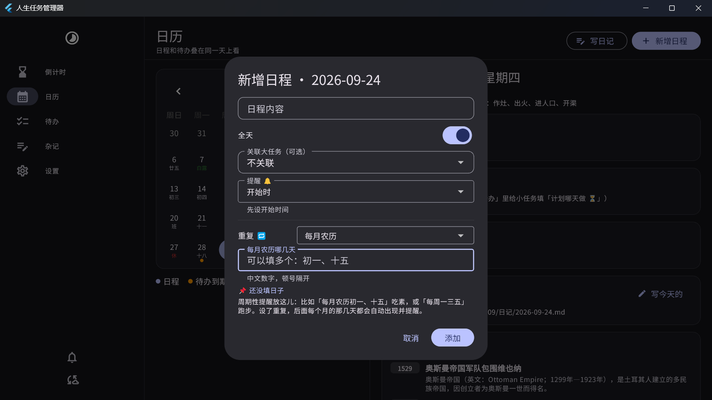

# 人生任务管理器

> 人生倒计时 + 日历 + 待办 + 杂记，四件事连成一条线。
> **数据是你自己硬盘上的一堆 Markdown 文件**，不是锁在某个数据库里；要上云只走 WebDAV（坚果云），服务器只当运输通道。

Windows 版正在开发中（可跑），Android / macOS 后续跟上。

---



## 它解决的到底是什么问题

普通待办软件的毛病是：**任务和你的生活是分开的**。
这个软件想把四件事串起来：

```
人生倒计时 ── 给人危机感，知道时间还剩多少
    │
日历 ──────── 日程和"哪天做"的待办叠在同一天里看
    │
待办 ──────── 大任务拆小任务，小任务可以挂截止日期、计划日期
    │
杂记 ──────── 做完任务顺手写一句（任务杂记）；每天写点东西（日记杂记）
```

- **任务杂记**：勾掉一个小任务时，弹窗问你"怎么做的、卡在哪"，不想写可以跳过，事后也能补
- **日记杂记**：和日历的"某一天"绑定
- **大小任务联动**：大任务能细化成小任务，两个层级都能挂杂记

## 数据长什么样（这是这个软件的核心设计）

一个文件夹就是一个"vault"，里面全是纯文本，**用 Obsidian 也能直接打开**：

```
人生任务管理器/
  config/profile.json        人生期限（出生日期 / 预期寿命 / 终点）
  大任务/
    2026-09-28_草坪机器人毕设.md    ← 一个大任务一个文件
  日程/
    202609.json                     ← 按月存日程
  杂记/
    202609/
      日记/2026-09-28.md            ← 日记杂记
      任务/2026-09-26_草坪机器人毕设.md  ← 任务杂记
  月报/
    202609-月报.md                  ← 月度总结 + 评分（规划中）
  回收站/                           ← 删除的东西留 30 天
```

大任务文件里小任务写成一行一个，用的是 Obsidian Tasks 插件的表情语法：

```markdown
---
id: t-s2b749ak
type: 大任务
title: 草坪机器人毕设
created: 2026-09-28
deadline: 2027-01-26
tags: [毕设, 机器人]
---

# 草坪机器人毕设

基于视觉的路径规划，目标是让仿真能跑通完整流程。

## 子任务
- [x] 写完开题报告 ⏫ ✅ 2026-09-26 ^s-hecvvj
- [ ] 跑通仿真最小示例 ⏳ 2026-09-29 📅 2026-10-01 ⏫ ^s-cywhym
- [ ] 整理答辩 PPT 📅 2026-10-08 🔼 ^s-xc4s56
```

- `📅` 截止日期（最晚什么时候做完）
- `⏳` 计划哪天做（很多事没有死线，只是想哪天动）
- `⏫🔼🔽` 高/中/低优先级
- `✅` 完成日期
- `^s-xxxxxx` 稳定 ID，任务杂记靠它反链回来

**改文件只做"行级手术"**：勾选一个小任务只会替换那一行，你在 Obsidian 里手写的备注、格式、段落一个字节都不会被动。

## 同步（WebDAV）

三态比较，绝不静默覆盖：

| 情况 | 处理 |
|---|---|
| 只有一边改了 | 上传 / 下载 |
| 两边都改了同一文件 | **两份都留**，生成 `xxx.冲突-设备名-时间.md` |
| 一边删了、另一边没改 | 跟着删（本机删除 = 进回收站） |
| 一边删了、另一边改过 | 保住改过的那份 |

配置步骤、额度限制、常见报错见 👉 [docs/坚果云同步设置教程.md](docs/坚果云同步设置教程.md)

## 怎么跑起来

需要：
- Flutter 3.47.5（stable）
- Visual Studio 2022 生成工具 + "C++ 桌面开发"工作负载
- **Windows 开发者模式必须打开**（带原生插件的构建要建符号链接）：
  `设置 → 系统 → 开发者选项 → 开发人员模式`

```bash
flutter pub get
flutter test                 # 124 个测试
flutter build windows --debug
```

### 出发布版（注意：别直接在本目录 build --release）

Flutter 的 AOT 汇编步骤在**中文路径**下会崩（MSBuild 按 GBK 解路径，读不到 app.dill），
debug 构建不走 AOT 所以没事。用脚本绕开：

```powershell
powershell -ExecutionPolicy Bypass -File tool\build_release.ps1
```

它会把源码复制到一个纯 ASCII 路径编译，再把产物拷到 `dist\`。
`dist\` 里整个文件夹拷走就能用（用户数据不在程序目录，仍在 vault 里）。

### 出安装包（给别人的那种）

```powershell
powershell -ExecutionPolicy Bypass -File tool\build_installer.ps1
```

产物在 `dist_installer\LifeTaskManager-1.0.0-setup.exe`：中文向导、一路下一步、
**能自己选安装位置**，装完自动建开始菜单和（可选的）桌面快捷方式。
需要 Inno Setup 6（`winget install JRSoftware.InnoSetup`）。
卸载**不会**删用户数据——数据在「文档\LifeTaskManager」，跟程序目录是分开的。

想塞一份示例数据看效果：

```bash
dart run tool/seed_demo.dart "C:/Users/你的用户名/Documents/LifeTaskManager"
```

想验证 WebDAV 同步（用本机假服务器，不碰真实数据）：

```bash
pip install wsgidav cheroot
wsgidav --host=127.0.0.1 --port=8099 --root=/tmp/davroot --auth=anonymous
dart run tool/webdav_check.dart http://127.0.0.1:8099/ u p /ltm
```

## 进度

已完成（Windows）：
- [x] 人生倒计时（年/天/时/分/秒，每秒跳动、进度百分比、今年/本月/本周还剩）
- [x] 大任务 → 小任务，勾选写回 md，完成时可写任务杂记
- [x] 日历：月视图 + 日程 + 到期任务 + 计划任务 + 当天日记
- [x] 日历小趣味：农历/节气/干支、法定节假日（休/班）、节日祝福、历史上的今天，**每一项都能单独开关**
- [x] 定时任务：🔁 每月15日、每月农历十五、每周一、每年农历八月十五…写进 md，到点提醒
- [x] 任务提醒 🔔：到期当天 / 提前 N 天 / 指定时间（每条任务单独设）
- [x] 日程提醒 🔔：开始时 / 提前 10 分钟 / 30 分钟 / 1 小时 / 1 天
- [x] 小铃铛面板 + Windows 系统通知（同一件事只弹一次，可补最近 7 天错过的）
- [x] AI 周报 / 双周报 / 月报 / 季报 / 自定义天数报告，**周期和时间点自己选**
      （周报＝选周几总结上一周，月报＝选几号总结上个月，季度同理）
- [x] AI 设置：自己填 API Key，内置 DeepSeek / 通义千问 / 智谱 / Kimi / 硅基流动 /
      OpenAI / Claude / 本机 Ollama / 自定义 九家预设（类似 cc-switch 的一键切换）
- [x] 评分分两层：客观分（本地规则，可复现）+ AI 主观分和评语，综合分取平均；
      AI 没配好或网络挂了照样出报告，只是没有评语
- [x] Windows 安装包（Inno Setup，中文向导、可选安装路径、卸载不动用户数据）
- [x] 杂记：按月归档，Markdown 实时预览
- [x] WebDAV 双向同步 + 冲突副本 + 回收站
- [x] 亮/暗主题（默认跟随系统）、右下角托盘常驻、托盘悬停显示倒计时
- [x] 关窗口可选用「缩到托盘 / 直接退出 / 每次问我」，设置里随时改
- [x] 倒计时页显示最近一期报告的评分和评语，点开可看全文
- [x] 自定义背景图 + 模糊程度（图片放「文档/LifeTaskManager/config/背景/」，只存本机不同步）
- [x] Android 版：三个 APK（arm64-v8a / armeabi-v7a / x86_64），通知走系统闹钟预约，
      关机重启后自动重挂，安卓 12+ 会申请精确闹钟权限
- [x] 无边框窗口 + 自绘标题栏（可拖动、双击最大化，最小化/最大化/关闭自己画）
- [x] 178 个自动化测试（数据格式、倒计时、重复规则、提醒规则、报告计算、同步冲突、界面冒烟）

规划中：
- [ ] WebDAV 同步范围逐项勾选（任务/日程/杂记/报告 分开同步）
- [ ] 窄屏自适应（手机上导航栏收成底部标签栏）
- [ ] macOS 版
- [ ] 导入导出、搜索

## 支持作者

软件免费、开源，所有功能都不需要付费。如果它确实帮到你了，可以扫码请我喝瓶水（定额 5 元，纯自愿）。

## 许可

MIT（见 [LICENSE](LICENSE)，可以随意使用、修改、再分发，保留版权声明即可）。
